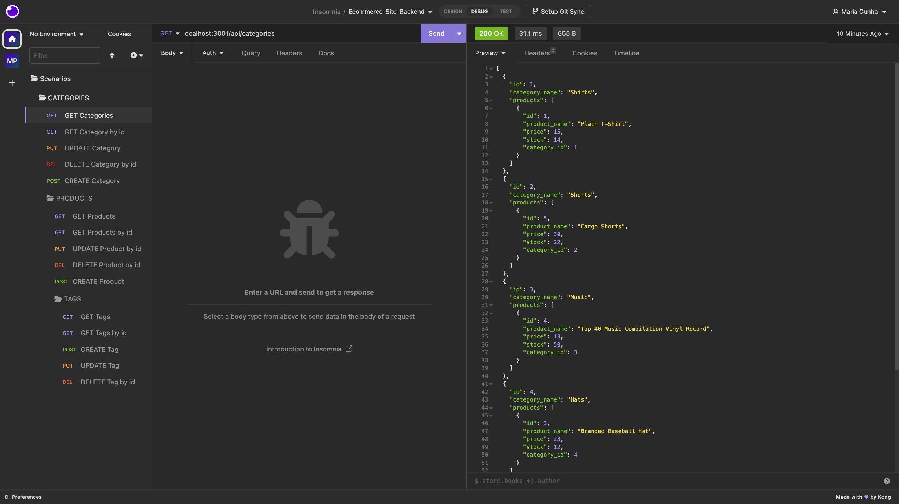

# Back End for E-commerce Site

The displayed license badge is sourced from <a href="https://shields.io/category/license">Shields IO</a>.

## Description
This project provides a back-end solution for an e-commerce website using the latest technologies. It allows a manager at an internet retail company to have a functional Express.js API to compete with other e-commerce companies.

This solution was created using [starter code](https://github.com/coding-boot-camp/fantastic-umbrella) from [Xander Rapstine](https://github.com/Xandromus), which contained contributions from <a href="https://github.com/Georgeyoo">Georgeyoo</a> and <a href="https://docs.github.com/en/code-security/dependabot/dependabot-security-updates/configuring-dependabot-security-updates">dependabot</a>.

You can view a video demonstrating the code's functionality [here](https://drive.google.com/file/d/1sWL6UEiGLZhQTYTLvgbS63ME-vbP2DqE/view?usp=sharing) and the GitHub repository [here](https://github.com/MCunha17/ecommerce-site-back-end).

## Table of Contents
* [Features](#features)
* [Usage](#usage)
* [Technologies Used](#technologies-used)
* [Contributing](#contributing)
* [Tests](#tests)
* [License](#license)
* [Resources](#resources)
* [Questions](#questions)

## Features
* Express.js API: Sets up an Express.js API as the back end for the e-commerce website.
* Sequelize Integration: Integrates Sequelize for interacting with a MySQL database.
* Environment Variables: The code securely stores the database credentials using environment variables.
* Database Initialization and Seeding: The code initializes the development database and populates it with test data using schema and seed commands.
* Server Initialization: The code starts the server, enabling communication between the client and the API by invoking the application.
* CRUD Operations: The code provides API routes for performing CRUD operations on categories, products, and tags, allowing create, read, update, and delete data in the MSQL database.
* JSON Response Formatting: The code ensures that the API's GET routes return properly formatted JSON responses for categories, products, and tags.
* Error Handling: The code includes mechanisms to respond to errors that may occur during API requests.

## Usage
To install and use the project, follow these steps:

1. Clone the repository to your local machine.
2. Install the required dependencies.
3. Create an environment variable file and add your database name, MySQL username, and MySQL password.
4. Run the schema and seed commands to create the development database and populate it with test data.
5. Start the server by running the command to invoke the application.
6. Use Insomnia Core to test the API routes for categories, products, and tags.
7. View, create, update, and delete data using the API GET, POST, PUT, and DELETE routes.

## Technologies Used
* JavaScript
* Node.js
* Express.js
* MySQL2
* Sequelize
* dotenv
* Insomnia Core

## Contributing
If you would like to contribute to this project, please fork the repository and submit a pull request with your proposed contributions.

## License
This project is licensed under: MIT License.

## Tests
Currently, there are no tests implemented for this project. If you would like to contribute, please follow the [contributing guidelines](#contributing).

## Resources
The following resources were referenced to create this application:

## Questions
If you have any questions, please visit my GitHub profile [MCunha17](https://github.com/MCunha17) or contact me at cunha.maria.theresa@gmail.com.